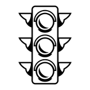

<!-- PROJECT LOGO -->

<div>
  <h1 align="center">Mobile Assignment 2 VTL</h1>

  <p align="center">
    <strong>Created by Johnny Chao</strong>
    <br />
    <strong>Student ID: 1111084</strong>
    <br />
        <strong>Auckland University of Technology</strong>
    <br />
            <h2 align="center">Mobile Systems Development COM826</h2>
</div>

<!-- ABOUT THE PROJECT -->
<br />
<br />

<p align='center'>

<br />

## About The Project

Youtube Link

### Built With

- Figma
- React Native
- Locofy
- Visual Studio
- Android Studio

<!-- GETTING STARTED -->

## Getting Started

To get a local copy up and running follow these simple example steps.\
_Note: This is an assumption you are running on a Windows PC_\

### Prerequisites

1. Node JS
2. Visual Studio Code
3. Download the code as a zip
4. Android Studio
5. React Native / Dependencies

### _Node JS_

Installing Node JS

- https://nodejs.org/en/download/

### _Visual Studio Code_

Installing VS code

- https://code.visualstudio.com/

### _The Project_

Extract the contents from the zip folder to your chosen location, and have it appear on VS code

### _Android Studio_

- Download and install [Android Studio](https://developer.android.com/studio)
- Edit your [Development environments](https://reactnative.dev/docs/environment-setup)
- ## How to fix [Unable to Locate Android SDK Problem](https://www.youtube.com/watch?v=7GuGlATHYX8&ab_channel=LearnwithShajeel)
  _To check for errors (Enter in VS code Terminal in the project's folder)_

```sh
npx @react-native-community/cli doctor
```

### _Dependencies_

Install the latest dependencies

```sh
npm install npm@latest -g
```

If the above does not work, proceed with installing it manually as shown below

```sh
npm install react-native-reanimated react-native-gesture-handler react-native-screens react-native-safe-area-context @react-native-community/masked-view
npm install @react-navigation/native-stack
npm install react-navigation
```

#

## Running the application

### `npm run android`

Builds the application, and then installs the new build onto Android emulator (or physical device).\
_Alternative command_

```
npx react-native run-android
```

Press "R R" to refresh the application in emulator.\
Alternatively can push "R" in the node terminal
